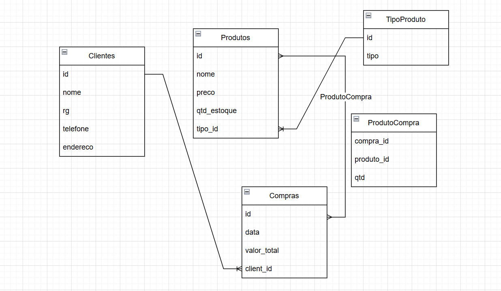

# Discover do projeto
Uma floricultura deseja informatizar suas operações. Inicialmente, deseja manter um cadastro de todos os seus clientes, mantendo informações como: RG, nome, telefone e endereço. Deseja também manter um cadastro contendo informações sobre os produtos que vende, tais como: nome do produto, tipo (flor, vaso, planta,...), preço e quantidade em estoque. Quando um cliente faz uma compra, a mesma é armazenada, mantendo informação sobre o cliente que fez a compra, a data da compra, o valor total e os produtos comprados.

## Tabelas

- Clientes [id, nome, RG, telefone e endereço]
- Produtos [ id, nome do produto, preço_und, quantidade em estoque, tipo_id]
- TipoProduto [ id, tipo ](valores: flor, vaso, planta)
- Compras [id ,cliente_id, data_compra, valor_total]
- ItensCompra [idCompra, idProduto, qtd]

